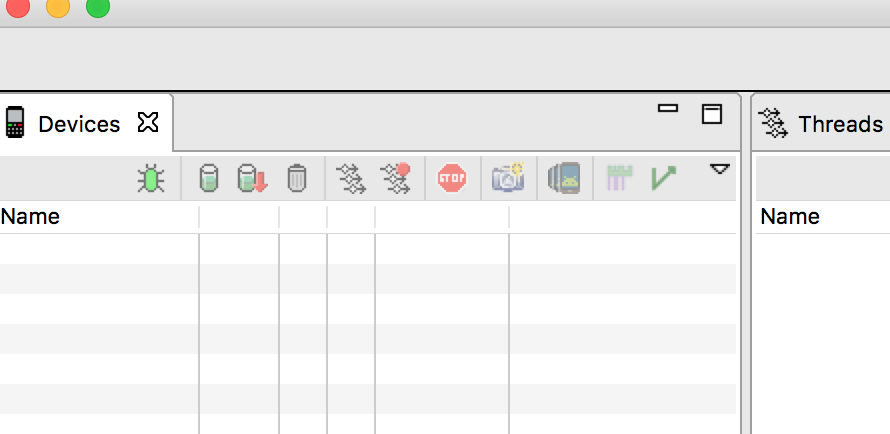

https://www.jianshu.com/p/75aa88d1b575

#### Systrace工具使用

##### 1.使用Android Device Monitor工具查看

- 路径：sdk/tools/monitor
- 在Android Device Monitor中，点击按钮执行，并生成.html文件，进行查看



#### 2.通过python脚本查看

##### 2.1. 使用命令行抓取Systrace的准备工作

抓取`systrace`之前，请完成以下步骤：

1. 下载并安装`Android SDK Tools`
2. 安装`Python ,`并将其包含在系统环境变量的path中。
3. 连接手机，打开开发者选项中的`USB Debug`选项 。
4. 查找`Systrace`脚本，存储路径如下：`android-sdk/platform-tools/systrace/`

##### 2.2. 使用命令行抓取 `Systrace`的语法

使用命令行抓取 `Systrace`的语法如下：
 `python systrace.py [options] [categories]`

##### 3.3. 使用命令行抓取 `Systrace`举例

例如，以下命令调用`systrace`在`10`秒钟内记录设备进程，包括图形进程，并生成一个名为`mynewtrace`的`HTML`报告：

```
python systrace.py --time=10 -o mynewtrace.html gfx
```

如果不指定任何类别或选项，`systrace`将生成包含所有可用类别的报告，并使用默认设置。 可用的类别取决于您使用的连接设备。

#### 3.在代码中添加trace标记

通常我们在怀疑引起jank代码地方，添加如下内容：
`Trace.beginSection("MyAdapter.onCreateViewHolder");`
和 `Trace.endSection();` 


