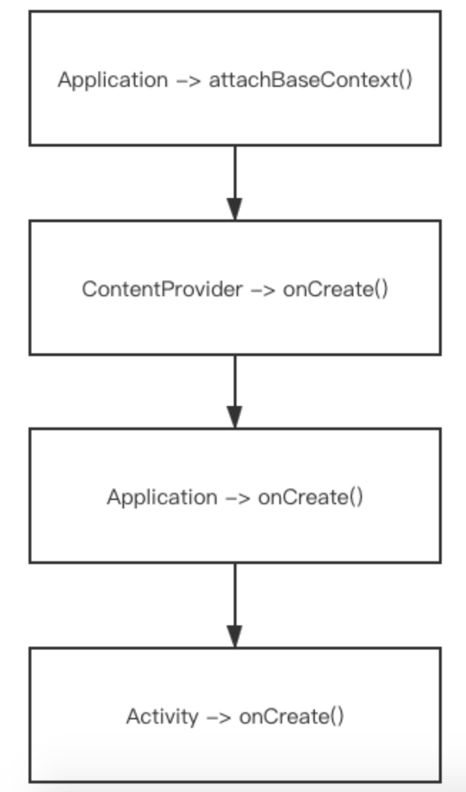

https://github.com/NoEndToLF/AppStartFaster
https://note.youdao.com/ynoteshare1/index.html?id=2e7418ead7993d20c6dcd5d2e565844f&type=note

https://www.cnblogs.com/huangjialin/p/13292042.html

### Application 启动优化

#### 1.在应用冷启动过程中，代码执行的方法流程如下

- 在应用冷启动过程中，很多都是系统方法调用，我们没办法操控，我们能做的就是application 和 activity的生命周期这部分，所以启动优化也是从这两块下手

**解析：**

- **1.Application.attachBaseContext(): **这个方法是在app冷启动流程中，应用程序调用的第一个方法
  - 在Android5.0版本以下，会调用MultDex.install() 方法，该方法的作用是为了解决单个dex文件方法总数超过65535问题，而将应用apk的字节码文件分成多个dex文件
  - MultDex.install() 方法非常耗时，可对其进行优化（先分析原理，在进行优化）
- **2.ContentProvider.onCreate(): **如果有内容提供者，会在上下文attach方法后执行
  - 很多第三方框架为了让自己的sdk先期执行，会将初始化方法设置在此处调用，而调用方需要在清单文件中进行内容提供者的注册（没有必要）
- **3.Application.onCreate():** 应用上下文初始化完成调用的方法，在该方法中很多第三方库会要求在该方法中进行初始化
- **4.Activity.onCreate():** 第一个界面调用的初始化方法

#### 2.Application 任务调度

- 假设在Application的onCreate方法会进行各种第三方sdk的初始化，这些初始化都是需要耗时，代码模拟如下

~~~java
public class MyApplication extends Application {

    @Override
    public void onCreate() {
        super.onCreate();
        Trace.beginSection("applicaiton start");
        tastA();
        tastB();
        tastC();
        tastD();
        Trace.endSection();
    }

    private void tastA() {
        try {
            Thread.sleep(300);
        } catch (InterruptedException e) {
            e.printStackTrace();
        }
    }

    private void tastB() {
        try {
            Thread.sleep(1050);
        } catch (InterruptedException e) {
            e.printStackTrace();
        }
    }

    private void tastC() {
        try {
            Thread.sleep(500);
        } catch (InterruptedException e) {
            e.printStackTrace();
        }
    }

    private void tastD() {
        try {
            Thread.sleep(200);
        } catch (InterruptedException e) {
            e.printStackTrace();
        }
    }
}
~~~

##### 2.1.上面在Applicaiton.onCreate() 方法中，是各种第三方sdk初始化调用，相信很多应用中都是这种情况，我通过sleep方法模拟每个sdk初始化的耗时，对于上诉情况应该如何优化呢？

**=>启动优化的思路是：能延迟加载的尽量延迟；能异步执行的尽量异步**

- 通过分析发现所有sdk初始化方法是串行调用的，可以考虑**多线程异步加载**
  - 异步线程加载不会阻塞主线程调用
  - 多个线程并发加载可以启动过个任务进行执行（执行会更快吗？）

##### 2.2.针对上诉方案，我们启动多个任务，每个任务执行一些操作，但是需要考虑几个问题

- 1.异步处理，如果在某个页面需要用到某个SDK，但是又没有初始化完成呢？
- 2.假如说taskB需要taskA的某个返回值呢？怎么保证taskA在taskB之前执行完毕？
- 3.开异步线程，开多个个线程呢？多了会造成资源浪费，少了资源又没有合理的利用。

##### 2.3.解决方案：

- 对于在Application.onCreate()方法中进行初始化任务的操作，需要先对这些任务进行一个优先级划分；
  - 对于那些优先级高的任务，可以先进行处理，优先级底的可以适当延迟进行加载
  - Android中还有一种延迟加载任务的方法是 IdleHandler().postDelayed(),这种方法治标不治本
    - 原因：1.该方法还是在主线程执行
    - 2.如果postDelayed方法中的任务耗时2s，延迟1s进行处理，那么在执行2s任务的过程中，有用户进行操作，岂不是很卡吗。

#### 3.方案实现：任务调度

- 所有的耗时操作封装成任务Task对象，传入到集合中
- 根据任务的依赖关系，形成一个有向无环图，然后通过拓扑排序列出任务的执行流程
- 任务的执行交给线程池处理，任务类型分为CPU密集型和IO密集型，根据不同的任务类型选用不同的线程池
- 通过CountDownLatch来控制某一个任务是否执行完毕才进行下一步

##### 3.1.如何确定一个任务是CPU密集型和IO密集型

- 通过Systrace确定wallTime和cpuTime，然后选择合适的线程池
- 多线程的本质是抢夺时间片，**cpuTime长的要选择定容线程池，**防止他并发时影响cpu效率
- 反之选择缓存线程池（IO密集型）
- **要点：** 不能造成主线程的卡顿，

代码实现：

~~~java

~~~

- 问题
  - 热启动：
    - 后台进程切换到前台进程，系统做了哪些事情
    - 进程优先级：adj
  - 冷启动耗时，知道了哪些方法调用耗时多少，如何进行优化？

