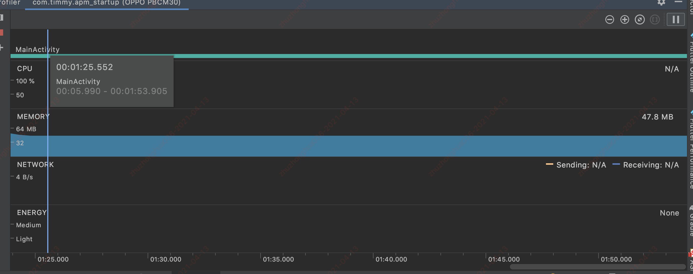
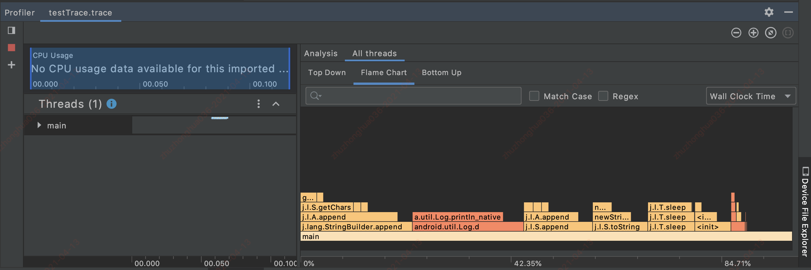
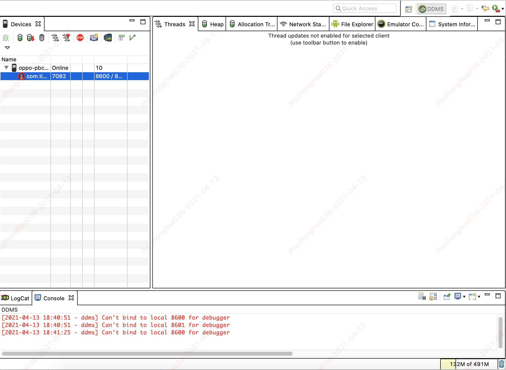

#### TraceView使用

#### 1.TraceView

- TraceView是Android平台配备的一个性能分析工具，它可以通过图形化的方式让我们了解要跟踪的程序性能如何，并且可以具体到方法。

#### 2.如何使用：

##### 2.1.通过AndroidStudio 自带的traceview查看（Android Profiler）

- 通过AS的 **Profile 'app'**方式启动应用
- 程序运行时，进行打点，TraceView工具会自动采集应用的各种性能数据
- 点击stop时，展示采集的数据

##### 2.2.通过Android SDK自带的Debug，在代码中打点采集

~~~java
    private void test() {
        Debug.startMethodTracing("testTrace");
        System.out.println("----testTrace----");
        for (int i = 0; i < 100; i++) {
            Log.d("APM", "item:" + i);
        }
        try {
            Thread.sleep(1);
        } catch (InterruptedException e) {
            e.printStackTrace();
        }
        Debug.stopMethodTracing();
    }
~~~

- 程序运行上述代码后，会在该路径下生成test.Trace.trace文件
  - /sdcard/Android/data/[packageName]/files/xxx.trace
- 将.trace文件拷贝出来，并在AS中打开，展示如下：

##### 2.3.通过DDMS中的traceview查看

- 打开DDMS（path：sdk/tools/monitor）

